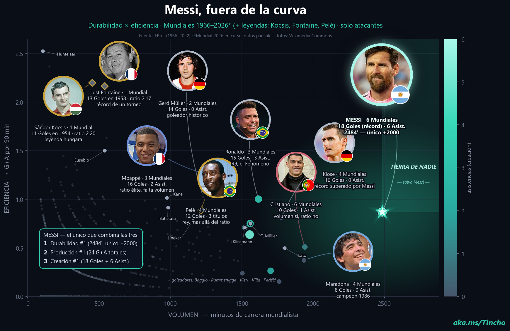

# ⚽🔬 messi-worldcup

> Un experimento de _data viz_ futbolera. Tomé 60 años de Mundiales (1966–2026\*),
> los puse en un plano de **volumen × eficiencia**, y busqué responder una sola
> pregunta con datos en vez de gritos de cancha:
>
> ### ¿Qué tan único es el perfil mundialista de Messi?

**Spoiler / el hallazgo:** con los datos **parciales del Mundial 2026** en curso, Messi
quedó como **máximo goleador histórico de Mundiales** (18 goles, superando los 16 de
Klose) y ocupa **él solo** una región del plano que bauticé _**Tierra de Nadie**_: mucho
volumen **y** mucha eficiencia, donde nadie más llega.

<p align="center">
  <br>
  <em>🎬 Versión animada: <a href="messi_profile.mp4"><code>messi_profile.mp4</code></a> &nbsp;·&nbsp;
  🌐 Post en vivo: <a href="https://martin-sciarrillo.github.io/messi-worldcup/">martin-sciarrillo.github.io/messi-worldcup</a></em>
</p>

---

## 🧪 La hipótesis

La grieta del GOAT suele ser ruidosa y poco falsable. Así que la convertí en algo medible:

> _Si tomamos solo Mundiales (el escenario máximo) y solo delanteros, ¿existe alguien que
> sea simultáneamente **durable**, **productivo** y **creativo** al nivel de Messi?_

Si la respuesta es "sí, varios", el perfil de Messi no tiene nada de especial. Si es "no,
ninguno", entonces hay una anomalía que merece un gráfico.

## 📐 La metodología

Un único plano cartesiano, tres dimensiones de información:

| Eje | Significado | Cómo se computa |
|-----|-------------|-----------------|
| **X — VOLUMEN** | Minutos de carrera mundialista | Suma de `minutes` de todas las ediciones |
| **Y — EFICIENCIA** | Goles + Asistencias por 90′ | `(G + A) / minutos × 90` |
| **Color** | Creación / asistencias | Asistencias totales (escala teal) |

**Reglas del experimento (para que sea justo):**

- Solo **delanteros** (`pos` contiene `FW`) — comparamos manzanas con manzanas.
- Mínimo **90′** jugados (un partido completo) para entrar al plano.
- Messi se dibuja como **estrella** y se resalta la zona de _alto volumen + alta eficiencia_.
- **Leyendas pre-Opta** (Kocsis 1954, Fontaine 1958, Pelé 1958–70) entran con un
  asterisco honesto: en su era **no se registraban asistencias**, así que su ratio es
  **solo-goles** y va marcado en oro, aparte de la nube principal.

**Fuente de datos:** [FBref](https://fbref.com/) (ediciones 1966–2022). Los deltas del
**Mundial 2026 en curso** se sumaron a mano desde prensa (FBref todavía no los publica) y
están claramente marcados como **parciales**. Retratos desde Wikipedia/Wikimedia. Ver
[`REFERENCES.md`](REFERENCES.md).

## 🏆 Los hallazgos

Messi es el **único** que clava el _hat-trick_ de los tres podios a la vez:

1. **Durabilidad #1** — 2484′, el único jugador con **+2000′** en Mundiales.
2. **Producción #1** — **24** contribuciones de gol (G+A) totales.
3. **Creación #1** — **18 goles + 6 asistencias**: lidera tanto en definición como en pase.

Otros llegan a una esquina, pero nunca a las tres:

- **Klose** (16 G) y **Cristiano** (volumen, 6 Mundiales) tienen recorrido, pero ratio bajo.
- **Mbappé** y **Kocsis/Fontaine** tienen ratio de élite, pero les falta volumen.
- **Pelé** es el rey de los títulos (3), pero el dataset moderno no lo mide por ratio.

Resultado: una **anomalía** estadística sentada sola en _Tierra de Nadie_.

> ⚠️ **Honestidad ante todo:** el titular de "máximo goleador histórico" usa datos
> **parciales** del Mundial 2026. Cuando FBref publique las cifras oficiales, los números
> se actualizan. El experimento vale por el **método**, no por el grito.

## 🔁 Reproducirlo

```bash
# 1) Dependencias
pip install pandas numpy matplotlib pillow scrapling

# 2) Bajar los retratos (no se versionan — ver .gitignore / REFERENCES.md)
python fetch_photos.py

# 3) (Opcional) re-scrapear FBref 1966–2022
python fetch_fbref.py
python build_data.py          # arma worldcup_all.csv

# 4) Renderizar
python build_portraits.py     # -> póster 300 dpi
python build_profile.py       # -> video MP4 animado
```

## 🗂️ Estructura

```
build_portraits.py   # póster final (plano volumen x eficiencia con retratos)
build_profile.py     # versión animada (MP4)
build_data.py        # parsea los dumps de FBref -> worldcup_all.csv
fetch_fbref.py       # scrapea las tablas de FBref por edición
fetch_photos.py      # baja retratos desde Wikipedia
worldcup_all.csv     # dataset limpio 1966–2022 (+ deltas 2026 en código)
flags/               # banderas circulares (dominio público)
*.png / *.mp4        # outputs renderizados
diag_*.py            # scripts de diagnóstico (la cocina del experimento)
```

## 🙌 Créditos

Datos: **FBref / Sports Reference**. Fotos: **Wikipedia / Wikimedia Commons**.
Código bajo licencia **MIT** (ver [`LICENSE`](LICENSE)). Atribución completa en
[`REFERENCES.md`](REFERENCES.md).

Hecho con curiosidad y bastante café por **[Martín Sciarrillo · aka.ms/Tincho](https://aka.ms/Tincho)**.

<sub>\* 1966–2026: el dataset cubre 1966–2022; las leyendas previas (1954/1958) y el
Mundial 2026 en curso entran como datos manuales/parciales, debidamente marcados.</sub>
